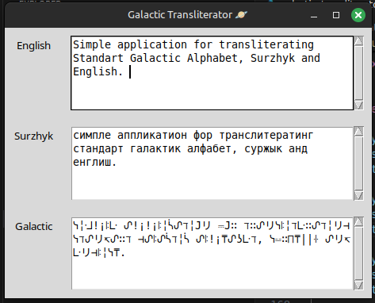
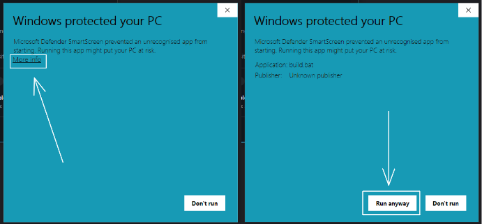
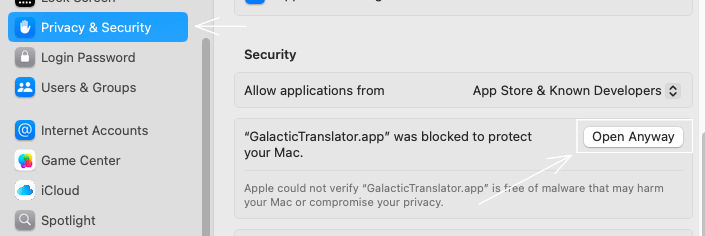

# Galactic Transliterator



Simple application for transliterating Standart Galactic Alphabet, Surzhyk and English. 

---

## 🔧 How to Use

Download and [**run**](#-running-the-executable) the executable from [**Releases**](https://github.com/herheliuk/galactic-transliterator/releases)

🪟 [Windows](https://github.com/herheliuk/galactic-transliterator/releases/download/releases/Galactictransliterator.exe) | 🍎 [macOS](https://github.com/herheliuk/galactic-transliterator/releases/download/releases/Galactictransliterator.app.zip) | 🐧 [Linux](https://github.com/herheliuk/galactic-transliterator/releases/download/releases/Galactictransliterator)

Or run the Python script directly:

### Windows

```bash
python galactic_transliterator.py
```

### Linux/macOS

```bash
python3 galactic_transliterator.py
```

---

## 🚀 Running the Executable

### Windows

Click 'More info' and then 'Run anyway'.



### macOS

Click apple logo at the lop left corner of the screen, then to go 'System Settings', 'Privacy and Security' and click 'Open Anyway' near 'GalacticTransliterator.app'.



### Linux

```bash
chmod +x GalacticTransliterator
./GalacticTransliterator
```
---

## 📦 How to Build

Run the provided build script:

### Windows

```bash
start build.bat
```

### Linux/macOS

```bash
bash build.sh
```

After building, navigate to the `dist` folder and run the generated executable.
